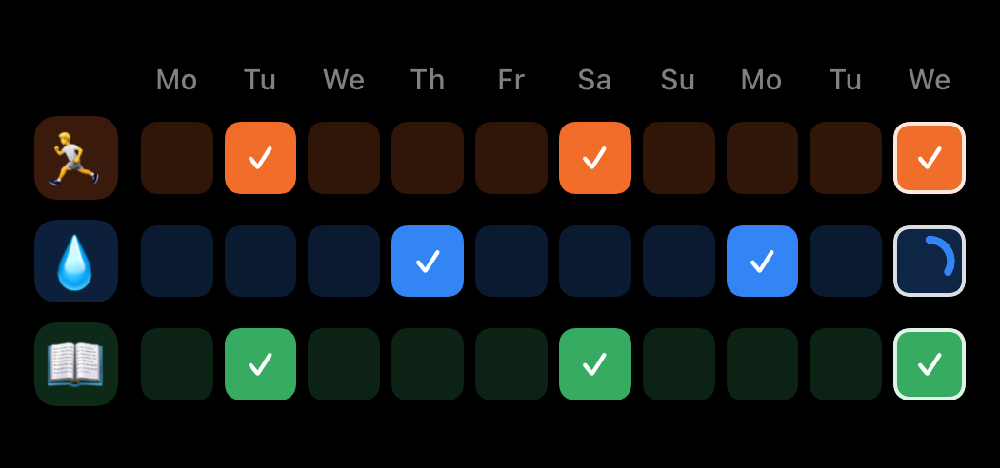
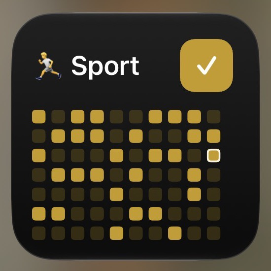
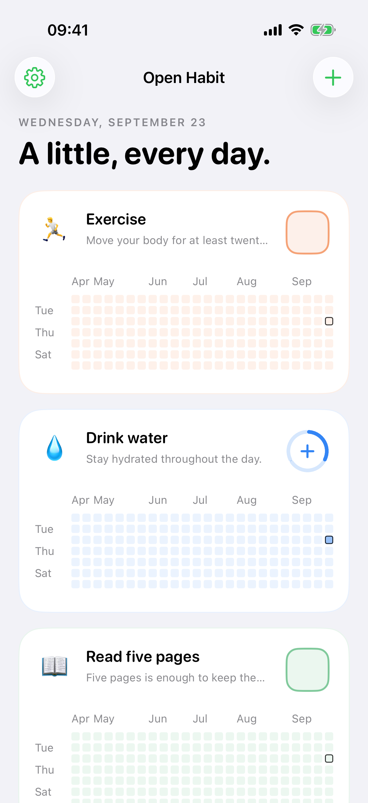
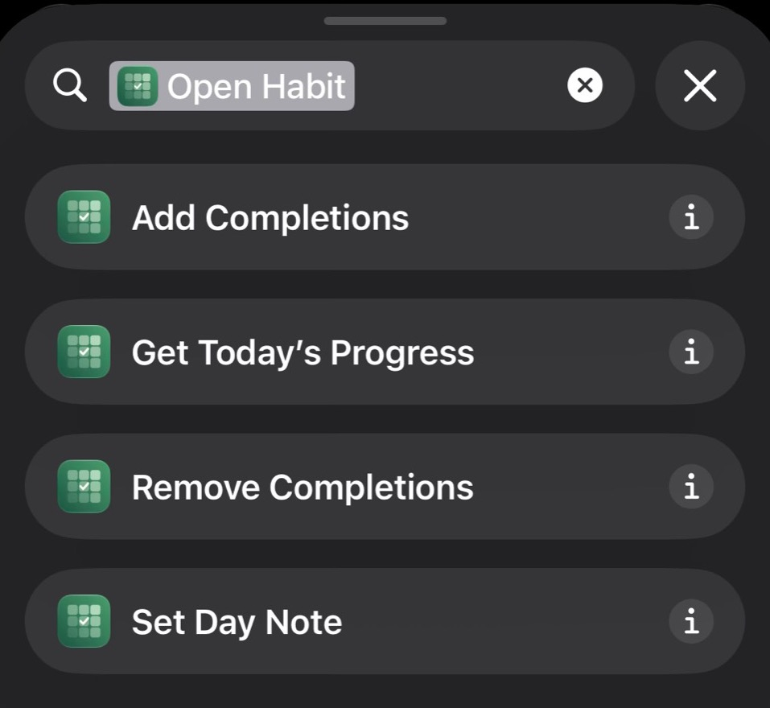
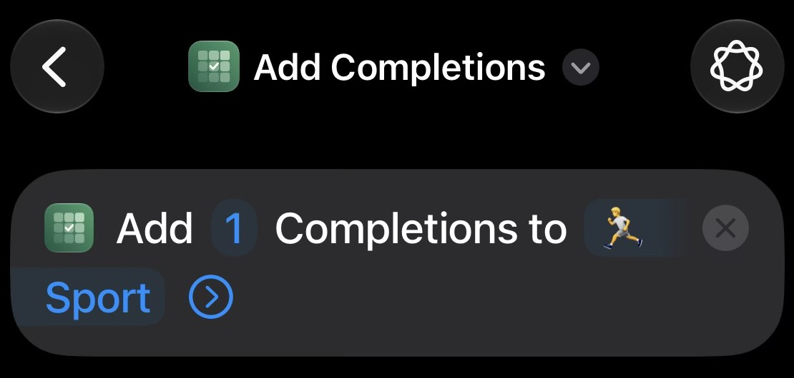

# Open Habit

### A little, every day.

Open Habit is a free, open-source habit tracker for iPhone and iPad. Make a quick check-in from your Home Screen, run an Apple Shortcut, or open the app when you want to see the bigger picture. No subscription, ads, or Open Habit account.

[Explore the website](https://getopenhabit.com/) · [Read the privacy policy](https://getopenhabit.com/privacy/)

## Check in without opening the app

Interactive widgets put your habits and recent progress on the Home Screen. Choose a widget for one, three, or six habits, then tap to record a completion.

  
  

## See your progress at a glance

Create habits with daily targets and optional streak goals. The overview shows a rolling year of history; open a habit for its monthly calendar, past-day corrections, and private Day Notes. Empty days stay empty—Open Habit does not label them failures.

## Make it work with Shortcuts

Use Open Habit actions in Apple's Shortcuts app to add or remove completions, get progress, and set Day Notes. Build a routine around them, then run it from Apple's Shortcuts widget or a Home Screen icon.

## Private, portable, and yours to change

Tracking works offline and saves locally first. Personal data can sync through your private iCloud database; Open Habit has no advertising, analytics, tracking SDKs, or developer-operated habit-data server. Export or restore a complete JSON backup, and import supported HabitKit version 2 exports.

Open Habit is built with Swift and SwiftUI under the [MIT license](LICENSE). Inspect the code, adapt it, or [contribute](CONTRIBUTING.md).

## Better together, when you choose

Share a habit with up to nine invited people. Members see the common habit definition, names, colors, and completion counts. Day Notes, categories, app settings, and unrelated habits remain private. Shared Habits require iOS or iPadOS 18 or later and iCloud; personal tracking works on iOS and iPadOS 17 or later.

## For contributors

[Build and test](docs/development.md) · [Contributing](CONTRIBUTING.md) · [Product design](docs/mvp.md) · [Verification notes](docs/verification.md) · [Security](SECURITY.md)

Questions or feedback? Visit [support](https://getopenhabit.com/support/) or email [contact@getopenhabit.com](mailto:contact@getopenhabit.com).

GitHub Actions runs the core, app, widget-rendering, deletion, and Shared Habit join tests for pull requests and pushes to `main`. Main does not publish automatically: a manual workflow run publishes a development build, RC tags publish to TestFlight, and stable tags submit the matching version for App Review. See the [release policy](docs/releases.md). The Files round-trip and SpringBoard widget-install tests stay local because they depend on a disposable Files container or persistent Home Screen state.

The App Store Connect API key must have the **App Manager** or **Admin** role so CI can add builds to the external group and submit them for Beta App Review.

For future releases, follow the [release process](docs/releases.md) and [signed-device verification](docs/verification.md). The [version 1.0 submission record](docs/app-store-submission.md) is retained for history.

## Implementation

- `OpenHabitCore`: domain values, fixed local date keys, deterministic edit reconciliation, full JSON validation, and locked atomic persistence.
- `OpenHabit/App`: overview, habit editor, rolling year and month calendar, Day Notes, archived habits, settings, export and confirmed replacement restore.
- `OpenHabit/Shared`: shared storage, private CloudKit synchronization, App Intents, and reusable history/completion visuals.
- `OpenHabit/Widgets`: configured small single-Habit and medium three-Habit interactive widgets. Hold a widget and choose Edit Widget to assign active Habits. Missing or archived assignments stay visible as configuration placeholders.
- `OpenHabitTests`: integration tests exercising all four intents and the widget button intent against real shared storage.
- `OpenHabitUITests`: an English-language Simulator smoke test that installs the small widget if missing and verifies its configuration menu. It changes the test Simulator’s Home Screen layout.

Cloud synchronization exchanges UUID-addressed edits. Distinct additions merge, retries are idempotent, properties/notes/order use the latest timestamp (UUID breaks ties), archive is independent of property editing, and deletion tombstones prevent resurrection. Restore and Delete All Data create a new dataset generation; older offline edits cannot bring replaced data back. Deletion and replacement redact removed content from the journal and synchronize those redactions; only causality markers remain so old offline edits cannot resurrect it.

The app synchronizes on activation, after edits, during foreground polling, and on iCloud push notifications. Widget and Shortcut actions commit locally first and attempt synchronization afterward. Cloud errors never roll back a successful local completion. The first implementation enumerates the entire private zone on each sync; incremental tokens and compaction of causality markers can be added when real dataset sizes justify them.

See [verification notes](docs/verification.md) for what has been tested and what still needs provisioned devices.
