# Open Habit UI glossary

Use these names when discussing the interface, reporting a bug, or requesting a design change. The underlying domain terms, such as Habit, Completion, Daily Target, Habit Day, and Day Note, are defined in [CONTEXT.md](../CONTEXT.md).

A **Habit Card** is inside the app. A **Home Screen Widget** is on the iPhone or iPad Home Screen. They are not the same thing.

The small squares are the **Completion Grid**. The numbered dates are the **Month Calendar**. A **Day Tile** is one cell in either of them. Use **touch and hold** or **long press**, not “force push”; pressure is not required.

## Screen map

```text
Overview
├── App Settings button
├── Add Habit button
└── Habit Card
    ├── Habit Header: emoji, name, description, optional badges
    ├── Completion Button: today's quick logging control
    ├── Compact Completion Grid: recent history
    └── Quick Actions menu: touch and hold anywhere on the card

Habit Detail
├── Habit Settings button: sliders icon, opens Edit Habit
├── Habit Header
├── Metric Cards
├── Month Calendar
├── Members Section: Shared Habits only
├── Inline Note Editor: selected date's private Day Note
└── Full Completion Grid: longer history at the bottom

Habit Settings (screen title: Edit Habit)
├── Habit Definition fields
├── Emoji Picker and Color Picker
├── Daily Target and Completion Preview
├── Streak Goal controls
├── Habit Actions: Private Habits
└── Sharing Controls: Shared Habits
```

## Overview and Habit Card

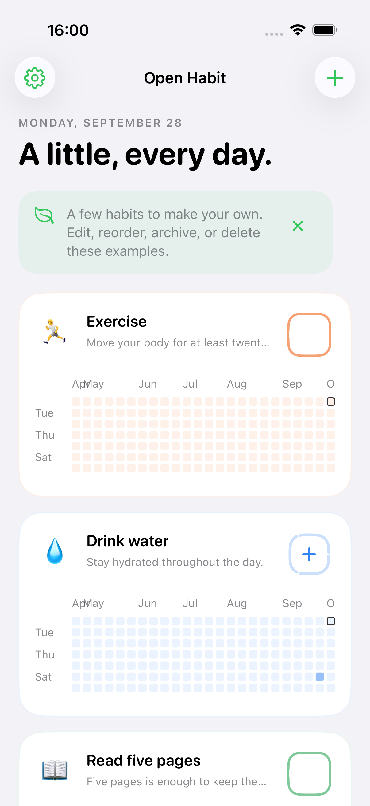

| Canonical name | Where to look | Behavior |
| --- | --- | --- |
| Overview | The screen titled Open Habit | Lists active Habits. |
| App Settings button | Gear at the top left | Opens settings for the whole app. |
| Add Habit button | Plus at the top right | Opens New Habit. |
| Habit Card | One large rounded container | Contains one Habit's header, quick logging control, and history. Touch and hold anywhere on it for Quick Actions. Hold and drag to reorder. Avoid “habit widget” or “pill” for this container. |
| Habit Header | Emoji, Habit name, and description at the top of the card | Tap to open Habit Detail. |
| Streak Badge | Optional flame and day/week count below the description | Shows Current Streak when a Streak Goal is enabled. It is not a Completion count. |
| Members Badge | Optional people icon and Member count | Identifies a Shared Habit. |
| Completion Button | Colored squircle at the top right | Each tap adds one Completion today. A tap after reaching the Daily Target clears today's Completions: `0 → 1 → … → target → 0`. |
| Compact Completion Grid | Small colored squares below the header | Tap anywhere in its area, including labels or gaps, to open Habit Detail. This does not log a Completion or select an individual day. Avoid “garden,” “candle area,” or “small calendar.” |

The Streak Badge and Members Badge appear only when applicable; the starter Habits in this screenshot do not have them.

### Completion Button states


From left to right: an empty single-target Habit, an empty multi-target Habit, partial Daily Progress, and a complete Habit Day. For multi-target Habits, each outline segment represents one Completion toward the Daily Target. The plus is part of the Completion Button, not a separate action.

### Quick Actions menu

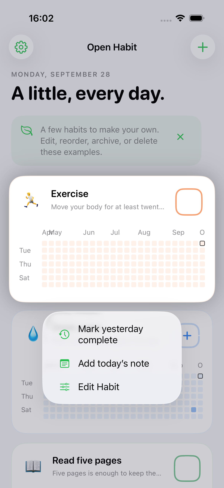

| Action | Result |
| --- | --- |
| Mark yesterday complete | Sets yesterday's Completion count to the Daily Target. It does not increment today's count. |
| Add today's note | Opens the Day Note Sheet for today. An existing note is loaded rather than erased. Saving is explicit. |
| Edit Habit | Opens Habit Settings. Its icon is sliders, matching the button in Habit Detail. Only the Owner can edit a Shared Habit's definition. |

Undo latest Completion today, Mark today complete, Archive Habit, and Delete Habit are not in Quick Actions. Today's quick logging belongs to the Completion Button; archive and delete belong to Habit Actions in Habit Settings.

## Habit Detail

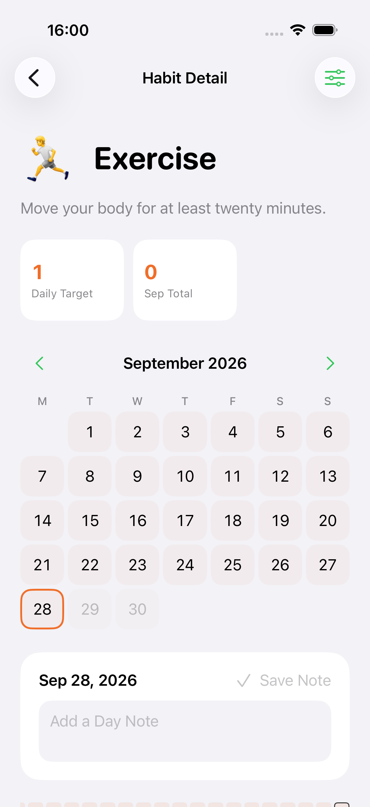

| Canonical name | Where to look | Behavior |
| --- | --- | --- |
| Habit Detail | The screen titled Habit Detail | Shows one Habit's progress, calendar, private notes, and longer history. Avoid “widget details.” |
| Habit Settings button | Sliders at the top right | Opens Edit Habit. Not available to non-Owner Members. |
| Metric Cards | Small rounded boxes above the calendar | Show Daily Target, Month Total, and Current Streak when enabled. The month total follows the displayed calendar month. |
| Month Calendar | Numbered dates under a month heading | Tap a past date or today to select it and cycle its Completions up to the Daily Target, then back to zero. Touch and hold to open its Day Note Sheet without incrementing Completions. Future dates are read-only. |
| Month Navigation | Left and right chevrons around the month heading | Changes the displayed month. |
| Day Tile | One date cell in a calendar or grid | Represents one Habit Day. Its fill shows Daily Progress, not the presence of a note. |
| Today Outline | Border around today's Day Tile | Identifies today. |
| Selected Date Outline | Habit-colored border in the Month Calendar | Identifies the date shown in the Inline Note Editor. Today and the selected date can be different. |
| Note Indicator | Tiny dot on a Day Tile | Indicates that the Habit Day has a Day Note. It is not an extra Completion. |

### Inline Note Editor and Full Completion Grid

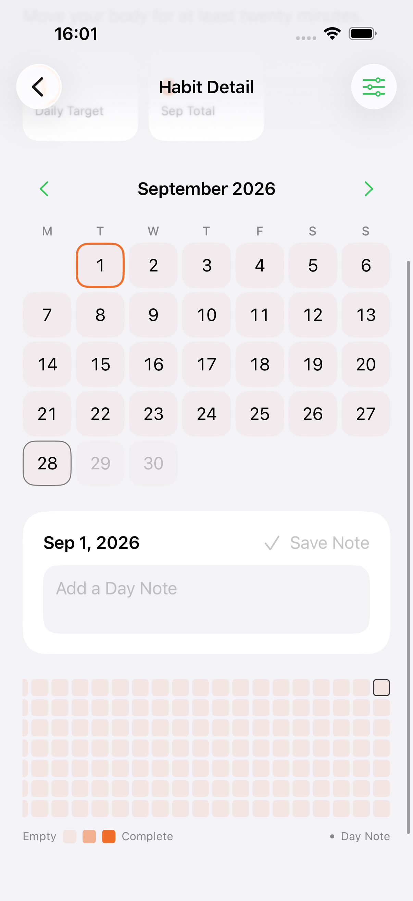

| Canonical name | Where to look | Behavior |
| --- | --- | --- |
| Inline Note Editor | Rounded box with a date, text field, and Save Note | Edits the selected Habit Day's private Day Note within Habit Detail. Focus scrolls the box above the keyboard. Save Note persists changes. |
| Day Note field | Text input inside the Inline Note Editor or Day Note Sheet | Plain text, up to 500 characters. The limit message appears only when the limit is reached. |
| Full Completion Grid | Small squares at the very bottom of Habit Detail | Shows 53 weeks of history and scrolls horizontally. Tap a past tile to select its date for the Inline Note Editor, without changing Completions. Touch and hold to open its Day Note Sheet. The remaining days of the current week are drawn empty and are read-only. |
| Completion Legend | Empty-to-Complete swatches and Day Note dot below the grid | Explains the fill intensity and Note Indicator. |

“Completion Grid” is the shared name for both history presentations. Say **Compact Completion Grid** when referring to a Habit Card and **Full Completion Grid** when referring to the bottom of Habit Detail. The Month Calendar has different tap behavior, so do not call it a Completion Grid.

### Day Note Sheet

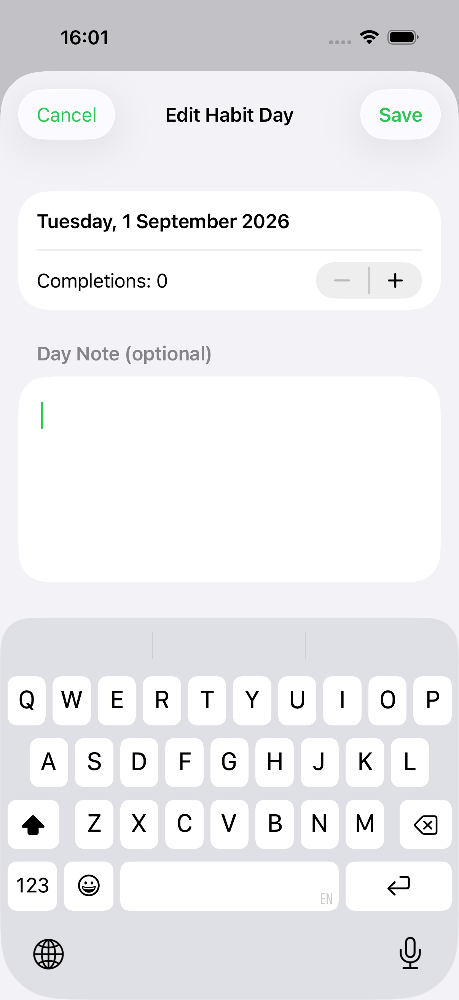

The **Day Note Sheet** is the separate editor titled **Edit Habit Day**. It opens from Add today's note or by touching and holding a past date. The **Completion Stepper** can correct that day's count, while the **Day Note field** edits its note. Save persists both values; Cancel discards the draft. Opening the sheet alone does not record a Completion.

This differs from the **Inline Note Editor**, which remains embedded in Habit Detail. Neither is the Habit Description, which belongs to the Habit definition.

## Habit Settings

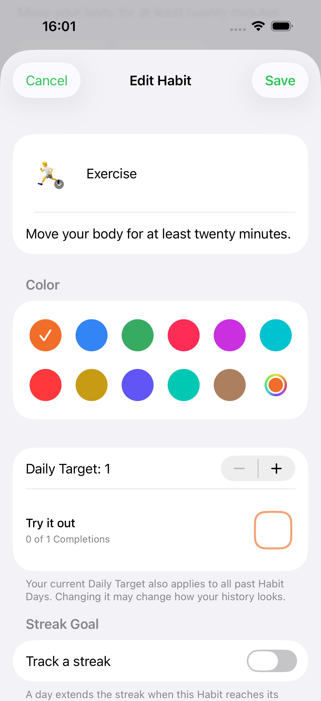

| Canonical name | Where to look | Behavior |
| --- | --- | --- |
| Habit Settings | The sheet titled Edit Habit | Settings for one Habit, not for the app. Cancel discards definition edits; Save applies them. New Habit uses the same form with Create. |
| Habit Definition fields | Emoji, name, and description at the top | Define what the Habit is. The description is not a dated Day Note. |
| Color Picker | Preset color circles and Custom color | Chooses the Habit's tint. Member Colors are separate. |
| Daily Target control | Stepper labeled Daily Target | Sets the threshold for interpreting both current and past Habit Days. |
| Completion Preview | Try it out row and sample Completion Button | Demonstrates the button's states without recording real Completions. |
| Streak Goal controls | Track a streak, Daily/Weekly, optional Weekly Goal | Configures how Current Streak is derived. |

### Emoji Picker

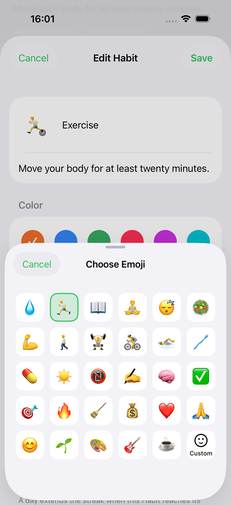

The **Emoji Picker** is the sheet titled **Choose Emoji**. Tap a preset to select it. **Custom Emoji** is the separate full-screen input opened by Custom; it accepts one emoji from the system keyboard. These names distinguish the app's preset picker from iOS's emoji keyboard.

### Habit Actions

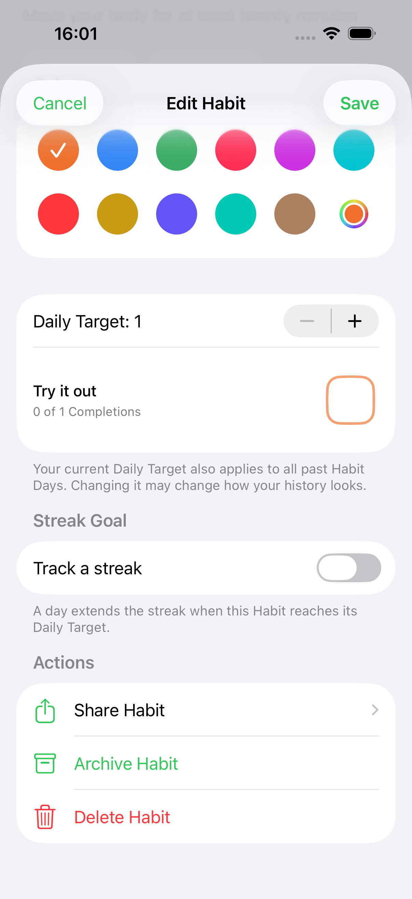

The **Habit Actions** section is the grouped list of Share Habit, Archive Habit, and Delete Habit for a Private Habit. Archive hides the Habit from active tracking while preserving it. Delete requires confirmation and removes its history. An Archived Habit offers Restore Habit instead of Archive Habit.

### Share Setup

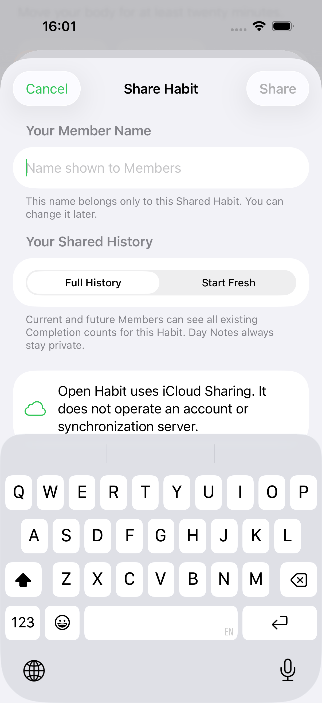

**Share Setup** is the sheet titled **Share Habit**. It asks for the Owner's Member Name and Shared History choice. Opening it does not start sharing; the Share button does that. Day Notes remain private under either history choice.

## Members and sharing

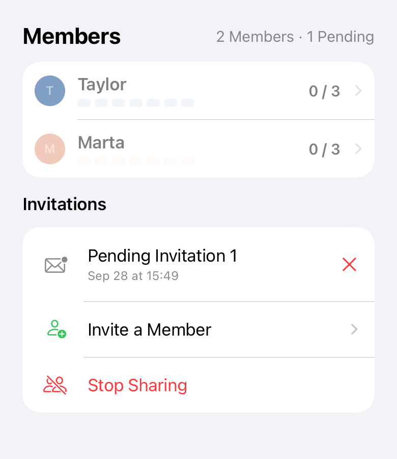

| Canonical name | Where to look | Behavior |
| --- | --- | --- |
| Members Section | Members heading and grouped Member Rows below the Month Calendar | Shows participants in a Shared Habit. |
| Member Row | Colored initial, name, seven small bars, today's count, and chevron | Tap to open Member Progress. The Owner can touch and hold another Member's row to remove them with confirmation. |
| Member Progress Strip | Seven short bars below a Member Name | Shows that Member's last seven days, not a Month Calendar. |
| Member Progress | Detail screen opened from a Member Row | Shows that Member's Completion counts and Full Completion Grid. Other Members' Day Notes are never shown. |
| Member Identity | Editor opened using the pencil by your own name in Member Progress | Edits your Member Name and Member Color for that Shared Habit. This pencil is separate from the Habit Settings icon. |
| Sharing Controls | Grouped invitation and membership-management rows | Appears under Sharing in Habit Settings; the current build also includes it with the Members Section in Habit Detail. |
| Pending Invitation row | Envelope, numbered invitation, creation date, and red cancel icon | Represents an unaccepted Invitation. Cancel Invitation revokes that Invitation, not an existing membership. |
| Invite a Member | Row with person-plus icon and chevron | Creates an Invitation, then opens the Invitation Sheet. Disabled when Members plus pending Invitations fill all ten places. |
| Stop Sharing | Red row for the Owner | Requires confirmation. Ends sharing for everyone while preserving their personal Habits and history. |
| Leave Shared Habit | Red row for a non-Owner Member | Requires confirmation. Ends that Member's shared visibility while preserving their Private Habit. |
| Invitation Sheet | Sheet titled Invite Member | Offers the created Invitation link for sharing or copying. |
| Sharing Progress Screen | Full-screen iCloud icon, spinner, action title, and message | Gives feedback while setting up sharing, creating/canceling an Invitation, stopping/leaving sharing, or removing a Member. It is not a success confirmation. |
| Join Flow | Your Name → Review Habit → Choose Your Habit | The invitation recipient's three-step flow, distinct from the Owner's Share Setup. |

The sharing illustration uses sample Members rendered from the real SwiftUI components. Capturing it does not create an iCloud Shared Habit or send an Invitation.

## App Settings

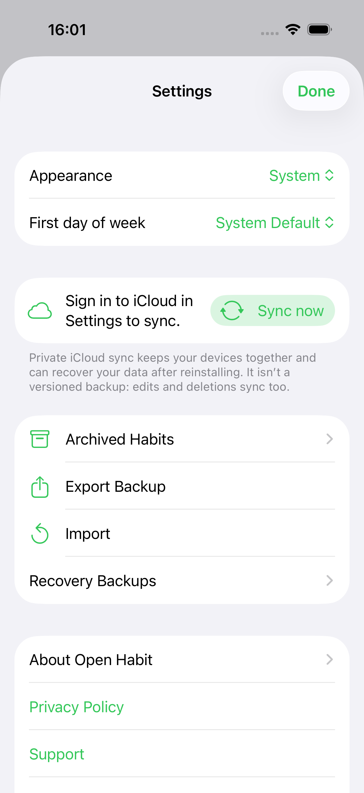

**App Settings** is the screen titled **Settings**, opened from the gear in Overview. It contains Appearance, First day of week, Sync Status and Sync now, Archived Habits, Export Backup, Import, Recovery Backups, About, and Delete All Data. These apply across the app rather than to one Habit.

**Archived Habits** is the list of preserved Habits excluded from Overview and widgets. **Recovery Backups** is the list of local recovery snapshots. **Import Confirmation** is the preview and choice of Add New Habits or Replace All Data before a Data Import is applied.

## Home Screen Widgets

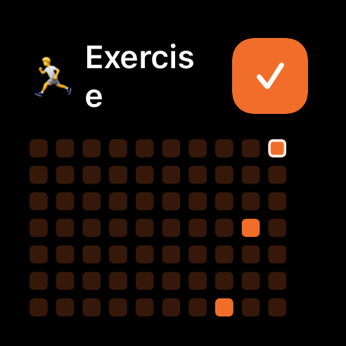
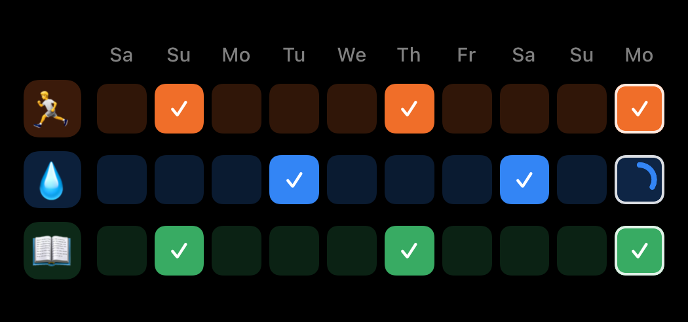
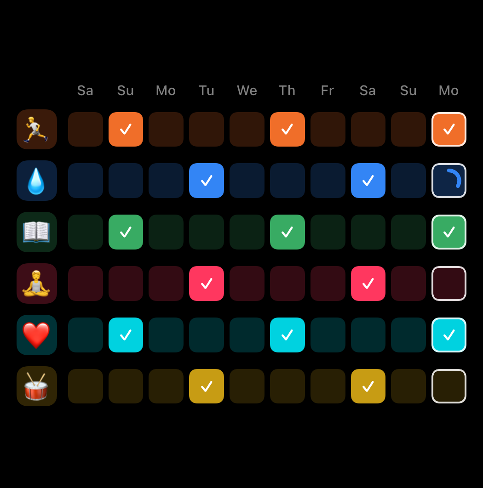

| Canonical name | Meaning and behavior |
| --- | --- |
| Home Screen Widget | An iOS widget outside the app. Touch and hold it for the system menu, including Edit Widget. This is not the Habit Card Quick Actions menu. |
| One Habit Widget | Small widget with one Habit, a Completion Button, and a Compact Completion Grid. The history opens Habit Detail; the Completion Button logs today. |
| Three Habits Widget / Six Habits Widget | Medium/large widget with three/six Habit rows and ten recent dates. |
| Widget Habit Row | One Habit's emoji and recent Day Tiles in a multi-Habit widget. |
| Recent Days Strip | The ten dates in a Widget Habit Row. Tap today to cycle Completions; past tiles open Habit Detail rather than log a Completion. |
| Widget Configuration | The system Edit Widget interface for choosing the active Habits to display. |

These widget illustrations are renders of the current widget components, not photographs of a configured Home Screen.

## Example requests using the names

> In Overview, tapping the Compact Completion Grid on the Exercise Habit Card should open Habit Detail without recording a Completion.

> In Habit Detail, move the Inline Note Editor below the Month Calendar and keep the Full Completion Grid at the bottom.

> In Habit Settings, put Invite a Member and Stop Sharing in the same grouped-row style as Habit Actions.

> In the Three Habits Widget, make today's Day Tile easier to distinguish in the Recent Days Strip.

## Code map and screenshot maintenance

| UI names | Implementation |
| --- | --- |
| Overview, Habit Card, Habit Header, badges, Quick Actions | `OpenHabit/App/OverviewView.swift` (`HabitCard`, `quickMenu`) |
| Completion Button, Day Tile, Compact/Full Completion Grid | `OpenHabit/Shared/HabitVisuals.swift` (`CompletionButton`, `DayTile`, `LabeledHistoryGrid`, `HistoryGrid`) |
| Habit Detail, Month Calendar, Inline Note Editor, Day Note Sheet | `OpenHabit/App/HabitDetailView.swift` (`HabitDetailView`, `MonthCalendar`, `selectedDay`, `DayEditor`) |
| Habit Settings, Emoji Picker, Custom Emoji, Habit Actions | `OpenHabit/App/HabitEditor.swift` (`HabitEditor`, `HabitEmojiPicker`, `CustomEmojiPicker`) |
| Members Section, Member Progress, Sharing Controls, Share Setup, Join Flow | `OpenHabit/App/SharedHabitViews.swift` |
| App Settings, Archived Habits, Recovery Backups, Import Confirmation | `OpenHabit/App/SettingsView.swift` |
| Home Screen Widgets and Recent Days Strip | `OpenHabit/Shared/HabitWidgetContent.swift`, `OpenHabit/Widgets/OpenHabitWidgets.swift` |

Screenshots captured on 28 September 2026 using the iPhone 17 Pro simulator and sample data. They document layout and vocabulary, not proof of a TestFlight deployment or live iCloud operation. The source names `HistoryGrid`, `HabitEditor`, and `DayEditor` are implementation names; use the UI names above when discussing the product.

To refresh the screenshots, run the opt-in `HabitDetailUITests/testCaptureUIGlossary` and `WidgetLayoutTests/testCaptureSharedHabitGlossary` tests with `TEST_RUNNER_GENERATE_UI_GLOSSARY=1`. Also run `WidgetLayoutTests/testAllWidgetSizesRender` and `testCompletionGlyphStatesRender`. Export their named attachments from the resulting `.xcresult` and replace the matching files in `docs/images/ui-glossary/`. Normal CI skips the two opt-in captures.
